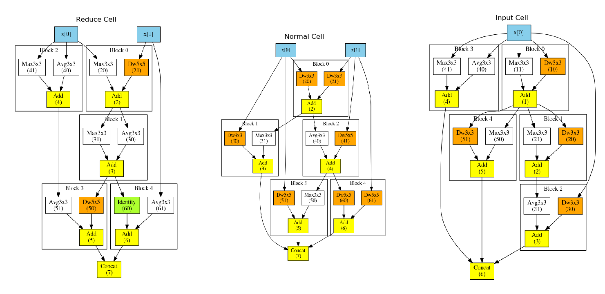
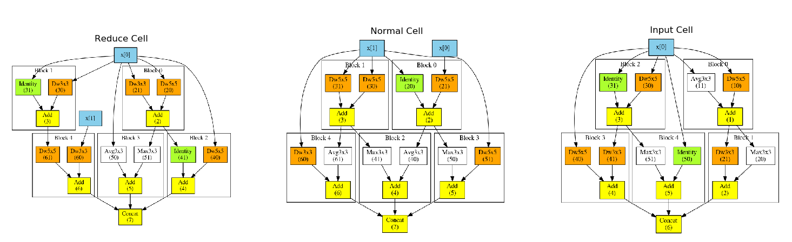

# Genetic Neural Architecture Search (GeneticNAS) 
The genetic neural architecture search (GeneticNAS) is a neural architecture search method that is based on genetic algorithm which utilized weight sharing accross all candidate network.

Includes code for CIFAR-10 and CIFAR-100 image classification 
 
# Installation
The first is install all the flowing prerequisites using conda:
* pytorch
* graphviz
* pygraphviz
* numpy

```javascript
    conda install graphviz
    conda install pytorch torchvision cudatoolkit=9.0 -c pytorch
    conda install pygraphviz
    conda install numpy
```

# Examples Run Search
In this section provide exmaple of how to run architecture search on there dataset CIFAR10 and CIFAR100, at the end of search a log folder is create under the current folder
#### CIFAR 10
```javascript
    python main.py --dataset_name CIFAR10 --config_file ./configs/config_cnn_search_cifar10.json
```
#### CIFAR 100
```javascript
    python main.py --dataset_name CIFAR100 --config_file ./configs/config_cnn_search_cifar100.json
```

# Examples Run Final Training
In this section provide exmaple of how to run final training search on there dataset CIFAR10 and CIFAR100, where $LOG_DIR is the log folder of the search result.
#### CIFAR 10
```javascript
    python main.py --dataset_name CIFAR10 --final 1 --serach_dir $LOG_DIR --config_file ./configs/config_cnn_final_cifar10.json
```
#### CIFAR 100
```javascript
    python main.py --dataset_name CIFAR100 --final 1 --serach_dir $LOG_DIR --config_file ./configs/config_cnn_final_cifar10.json
```

# Result

## CIFAR10 Counvulation Cell 



## CIFAR100 Counvulation Cell


## Counvulation cell final result
| Dataset | Accuracy[%] |
| --- | --- |
| CIFAR10 | 96% |
| CIFAR100 | 80.1% |
